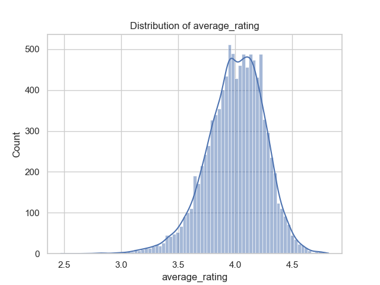

In the vast ocean of literature containing thousands of books, we embark on a comprehensive exploration of a dataset encompassing 10,000 book records, drawn from a diverse array of genres and authors. This dataset offers a treasure trove of information, from publication years and authorship to reader ratings and reviews.

### The Grand Overview

Picture a library bustling with the whispered excitement of readers flipping through pages. Among the 10,000 books in this virtual space, we find that a striking 4,664 authors have contributed their voices, with Stephen King leading the pack, his works mentioned a remarkable 60 times. This kind of popularity stirs intrigue, suggesting that a certain style or thematic resonance has captured the hearts of countless readers. 

Diving deeper into the data, we encounter an intricate tapestry woven with both classic and contemporary narratives. The average publication year of these works lands around 1981, suggesting a rich blend of classic literature and modern tales, yet some legacies stretch back as far as 1750! Each book, with its unique `goodreads_book_id` ranging as high as 33 million, stands testament to individual journeys through the written word.

### The Pulse of Reader Engagement

Reader interaction, as evidenced by ratings, breathes life into this collection. With an average rating of 4.00 out of 5, books in this dataset are generally well-received, yet there exists variance in how that satisfaction is articulated. The highest peaks reveal that some books amassed ratings from 11 up to over a million readers! The number of ratings gives us insight into popularity—while some titles linger in niche corners of literary appreciation, others echo throughout the reader community.

As we dissect the reader responses further, we discern that 23% of ratings hover around the 4-star mark, while a healthy 24% earn the coveted 5-stars. Strikingly, 66% of all reviews come with critique on an emotional rollercoaster, encapsulating both joy and disappointment. These statistics speak not only to the books' success but also reflect a community engaged in passionate discussion about the transformative power of literature.

### The Richness of Diversity

The width of diversity within the language codes also emerges as a key variable in this dataset, revealing a multilingual landscape where 25 languages intermingle, yet English remains dominant with 6,341 occurrences. This variety embodies the cultural richness of literature that stretches across borders, bringing together narratives that reflect varying human experiences.

Yet, amidst this diversity, we note some lapses in completeness; several entries are unfortunately missing ISBNs and original titles, and a few authors shy away from being recognized. These gaps might hint at self-published works or legacy titles lacking digital footprints. Nonetheless, not all is lost—these hiccups in the dataset don’t diminish its essence but merely reflect the multifaceted nature of literary heritage.

### The Statistical Symphony 

As we examine the statistics that punctuate this literary landscape, we find that the number of books per author averages around 75, demonstrating prolific outputs from numerous creators. Astonishingly, a few authors stretch this number to an incredible 3,455 titles, crafting an entire universe within their respective genres. 

Attention then turns to correlations within our dataset. Reaching into the finer nuances, we discover that the count of ratings presents an interesting dialogue with the quality of engagement—higher rating numbers correspond with greater quantities of reviews, indicating that truly engaging books invite broader discussion. However, it’s also noted that a book’s popularity doesn’t always correlate with high quality; some have abundant ratings yet lower average scores.

### The Lasting Impression

Ultimately, this odyssey through a digital library reveals a powerful narrative of human connection through literary art. Each book serves as a window into our collective psyche, each rating an echo of diverse voices and personal journeys. This dataset stands not just as a collection of titles but as a living document of the literary landscape—inviting readers to explore, critique, and champion the works that resonate most within their hearts. 

As we close this chapter, we leave with a sense of wonder at the stories yet to be told and the countless journeys yet to be embarked upon, driven by the timeless allure of the written word. Each data point illuminates the intricate dance between authors, readers, and the stories that bind them together—an enduring tapestry of human experience.

