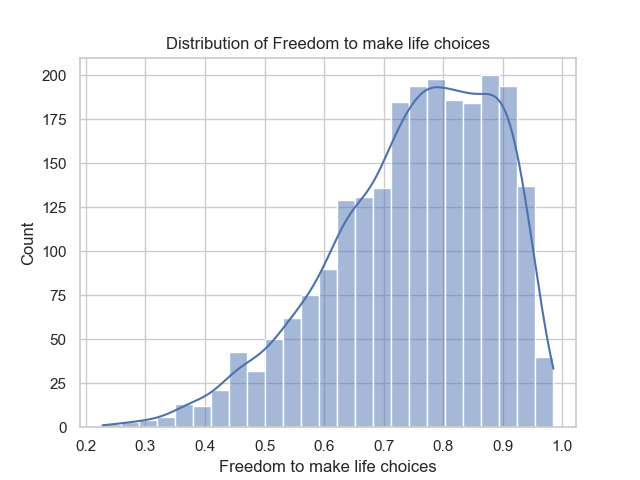
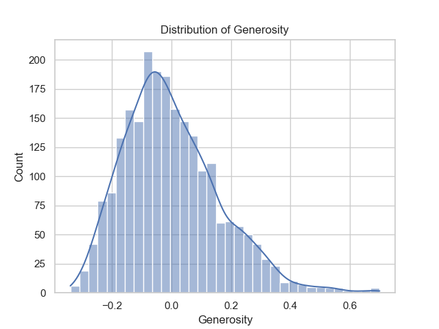
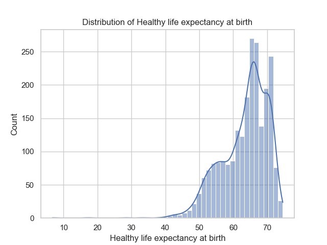
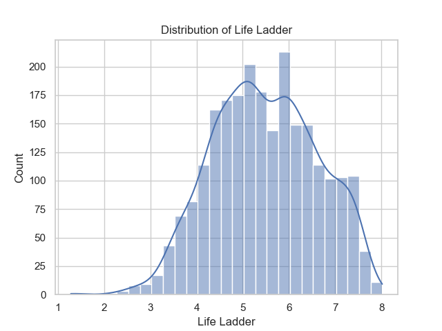
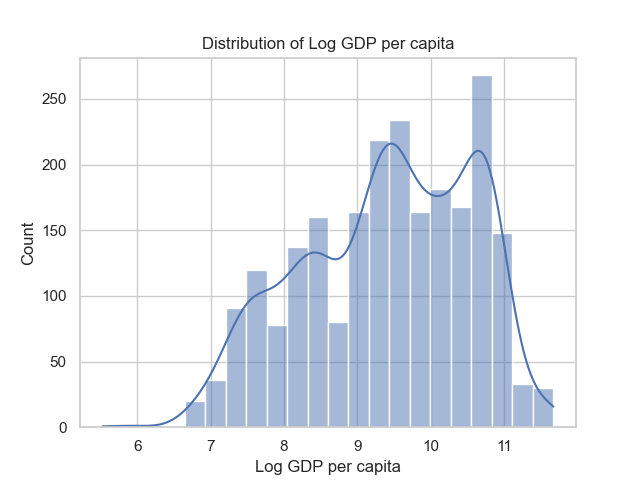
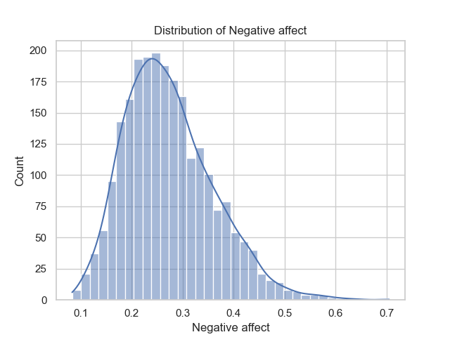
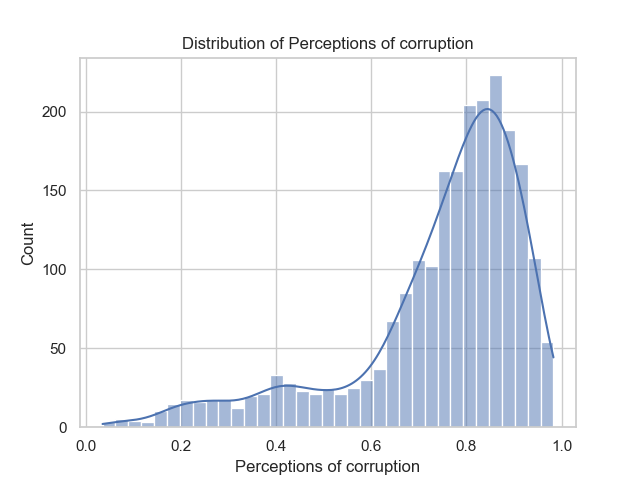
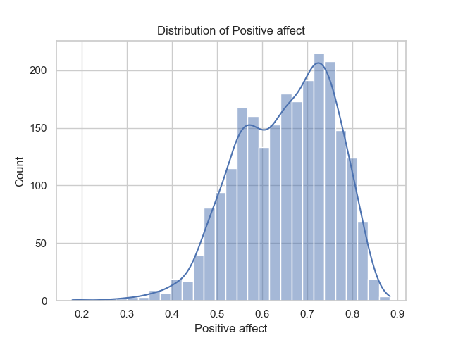
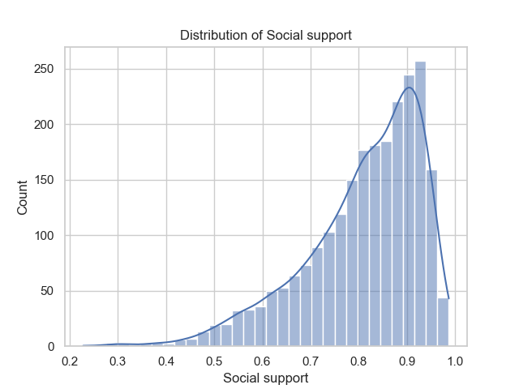
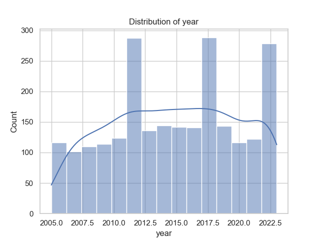

In the heart of a burgeoning social research initiative, a rich tapestry of global life satisfaction and well-being data emerges, revealing not only trends but poignant stories behind numbers. An extensive analysis of this dataset spanning 2363 observations across 165 unique countries invites us into a nuanced narrative of human experience. 

The very essence of these statistics is encapsulated in various indicators such as the 'Life Ladder,' an index showcasing subjective well-being, coupled with economic metrics like 'Log GDP per capita.' The year range from 2005 to 2023 serves as a timeline, grounding our findings in reality. A closer examination reveals an average ‘Life Ladder’ score of approximately 5.48; a modest but meaningful sum that speaks volumes about general contentment globally. Interpreting individual life circumstances, one can envision someone in Lebanon—home to the highest frequency of entries at 18 occurrences—navigating through the ebbs and flows of societal change while remaining resilient.

With the 'Log GDP per capita' averaging around 9.40, one can infer the economic landscape each country faces, substantially impacting citizens’ overall perception of happiness. The statistical gem indicates that wealth and well-being correlate strongly, as reflected by a remarkable correlation coefficient of approximately 0.78 between the 'Life Ladder' and 'Log GDP per capita'. On a broader canvas, individuals living in wealthier nations generally express higher satisfaction. However, there lies a paradox; in countries like Lebanon, conflicting socio-economic environments may dilute the optimistic projections that wealth alone can provide.

Dig deeper into the data, and threads of social support materialize—averaging at about 0.81, suggesting that community bonds cross the barriers woven between nations and cultures. This fosters positive connections; however, pockets of isolation still exist, as evidenced by the missing values in the 'Social Support' column. Imagine a young mother in Lebanon, her life tethered to a close-knit community, yet visible cracks hint at lost connections, echoing the need for stronger social networks in challenging times.

Equally fascinating is the assessment of 'Healthy life expectancy at birth' bearing an average of 63.40 years; a telling measure of the health landscape across nations. Despite the expected correlation of better life expectancy and higher happiness, the findings suggest a disjointed narrative where numbers tell a narrative of resilience. Consider someone born in a country with lower life expectancy but gushing with social bonds and emotional support—a story often overshadowed by stark statistics. 

Freedom emerges from the shadows, with an average score of 0.75 for 'Freedom to make life choices.' This is a vital index of self-determination; it informs a person's sense of agency in their journey through life. The correlation matrix reveals how strongly this freedom links with happiness (0.54), reflecting a universal truth: the liberty to make choices creates an intrinsic boost to life's satisfaction, celebrated in sunny neighborhoods and busy markets worldwide.

Yet, it is impossible to overlook aspects shadowing these findings. The average for 'Perceptions of corruption' is alarmingly high at 0.74. The public's trust erodes where governance fails, and individuals become wary; this relationship flips the narrative, connecting fewer opportunities for happiness. The intertwining of perceived corruption with negative and positive emotions reveals the delicate balance citizens navigate daily—a dichotomy where hope wrestles with despair.

In a world where mental health is gaining prominence, the data showcasing 'Positive affect' (averaging 0.65) and 'Negative affect' (averaging 0.27) becomes integral. The relationships among these emotions reveal how people celebrate life’s positive moments while grappling with inevitable struggles. 

The interspersed threads of generosity claim a fascinating narrative too. Though statistical averages lean towards the lower end at 0.0001, understanding this requires a lens that recognizes cultural and contextual differences in social generosity and its impacts on happiness.

In the grand tapestry woven by this data, a collective voice emerges. We see stories of endurance in Syria and Turkey, community spirit in Lebanon, frustration in South America, and resilience in Africa. These statistics are far more than numbers; they are voices, lives, and dreams, all intricately connected to the quest for happiness and the myriad ways in which societies strive to cultivate it, reflecting the undeniable truth that our happiest moments often arise from connections with one another, rather than merely from our material circumstances.

