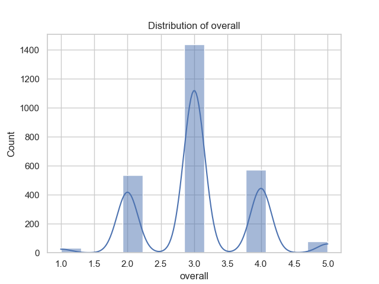
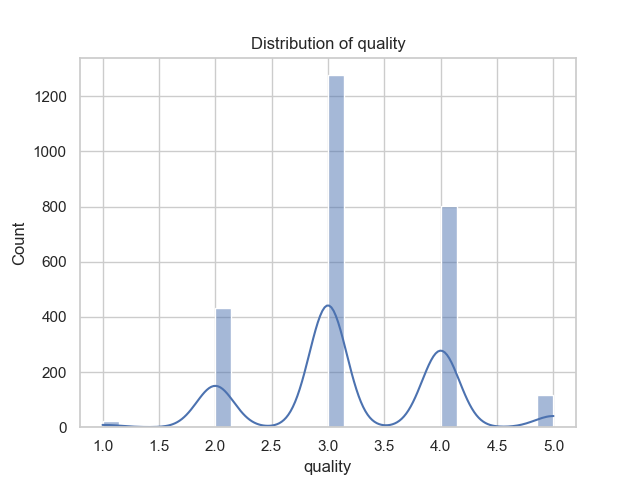
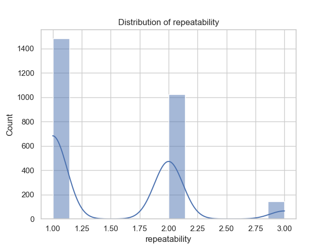

Once upon a time in a digital realm, thousands of tales were woven into the fabric of entertainment, capturing the imaginations of diverse audiences across the globe. This story isn't just about the content but also about the intricate patterns behind how those stories were told, experienced, and valued.

At the heart of this narrative was a substantial dataset, teeming with information about 2,652 unique entries. Each entry tried to encapsulate a moment in cinema or television, bringing forth a blend of emotions, cultures, and perspectives. Among these, 2,053 unique dates bore witness to the sheer variety and richness of the stories; notably, the date “21-May-06” stood out, having made itself known to the audience eight times, hinting that something significant may have transpired or been released on this day.

Language formed a vital backbone of this storytelling adventure, with 11 unique dialects being represented. English was the most prevalent language, spoken in 1,306 instances, hinting at its broad appeal and the tendency of narratives to be shared predominantly in this global lingua franca. However, it also opened the door to the fascinating intricacies of other languages that perhaps carried stories from different cultures and traditions.

The dataset further classified these tales as eight different types, with movies reigning supreme, accounting for an overwhelming majority of 2,211 entries. This affinity for movies signifies how visual storytelling captivated audiences' attention, providing an experience that transcended mere words. Amongst this cinematic treasure trove, one title rose above the rest: “Kanda Naal Mudhal,” which echoed through the collection with a frequency of nine, suggesting it may have struck a chord with viewers, resonating deeply through its themes or characters.

Curiously, the creators of these narratives were vast and varied, with Kiefer Sutherland taking the lead among 1,528 notable contributors. His involvement in 48 entries illustrates how certain figures become synonymous with storytelling, often becoming the hallmarks of quality and recognition in the eyes of viewers.

Statistics bore witness to the audience's reception of these stories, reflected in ratings that provided a glimpse into the viewers’ perceptions. The overall average rating settled around 3.05 out of 5, reflecting a generally favorable reception. Yet, nuances emerged in the quality scores, averaging slightly higher at 3.21, indicating that viewers recognized certain aspects of these narratives that distinguished them positively among contemporaries. The aspect of repeatability, rated at an average of 1.49, suggested that while some stories were so captivating that audiences returned to them, many remained one-time experiences.

Yet, not all was clear in this digital tapestry. Concerning the data's integrity, the 99 missing dates and 262 unnamed contributors suggested that some stories remained shrouded in mystery, their full context eluding even the keenest of analysts. Such gaps resonated like unresolved plot lines in a series, leaving audiences yearning for a resolution.

Interestingly, a dance of correlation emerged among various metrics. The relationship between overall ratings and quality was particularly strong, boasting a correlation coefficient of approximately 0.83, indicating that stories deemed higher in quality tended to be those with favorable overall ratings. Repeatability, while positive, showcased a weaker connection, hinting that while the quality of messages did encourage stories to be revisited, many audiences were inclined to experience a variety of narratives rather than dwell on repeat viewings.

In this multi-faceted tapestry of storytelling, viewers not only engaged with the art but also created a lively discourse surrounding their choices, preferences, and cultural significances. As the final notes of this narrative echoed, one could not help but reflect on the ever-evolving nature of storytelling, shaped by time, language, and human connection, reminding us that behind every data point lay an untold story waiting to be discovered.

